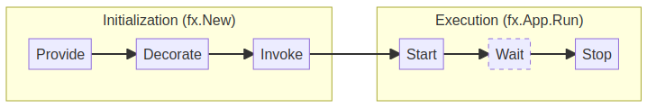

# Step 02: Add an HTTP server

We now have an FX application. 

Our next goal is to add an HTTP server to handle and respond to incoming requests.

## Documentation

### FX lifecycle

The FX lifecycle is a sequence of steps that are executed when the application starts and stops as follows:



- `fx.Provide()`

    This function expects a constructor function that returns a dependency that can be later injected into other functions.
   
    Example:
    ```go
    package main

    import (
        "go.uber.org/fx"
        "net/http"
   )

   func NewServer() *http.Server {
        return &http.Server{}
   }
   
   func main() {
       fx.New(
           fx.Provide(NewServer),
       ).Run()
   }
   ```


- `fx.Invoke()`

   This function expects a function that will be executed after all the dependencies have been provided.
   
  Example:
  ```go
  package main
   
  import (
      "go.uber.org/fx"
      "fmt"
  )

  func DoSomething() {
      fmt.Println("Do something")
  }
   
  func main() {
      fx.New(
          fx.Invoke(DoSomething),
      ).Run()
  }
  ```
   
- `fx.LifeCycle`

  This FX object can be injected in any function. It lets you add hooks to the application lifecycle, start & stop events. 

  Example:
  ```go
  package main
  
  import (
      "go.uber.org/fx"
      "fmt"
  )
  
  func DoSomething(lc fx.Lifecycle) {
      lc.Append(fx.Hook{
          OnStart: func(ctx context.Context) error {
                fmt.Println("App is starting...")
                return nil
		        },
          OnStop: func(ctx context.Context) error {
              fmt.Println("App is stopping...")
              return nil
          },
     })
  }
  
  func main() {
        fx.New(
            fx.Invoke(DoSomething),
        ).Run()
  }
  ```

### HTTP server

In this step, you'll find a `server.go` file that contains two functions:
 - `NewServer()`: This function returns a new HTTP server and should be used to provide the server dependency in FX.
 - `StartServer()`: This function should handle the server start and stop using the FX lifecyle.

## Tasks

1. Provide the `NewServer` function in the FX application.
2. Use the `fx.Lifecycle` object to start (`server.ListenAndServe`) and stop (`server.Shutdown`) the server in the `StartServer` function.
3. Invoke the `StartServer` function in the FX application.
4. Run the application  (`go run step02/*.go`) and test the server: `curl http://localhost:8080/`

At this point, you should have a running web server that responds to incoming requests.
The response, for now, is always `404 Not found`.

If you have the right output, you shall now proceed to the [next step](../step-03/README.md).
