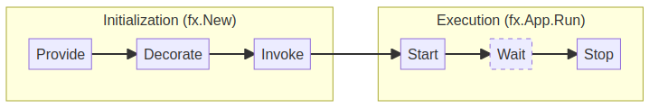

# Step 03: Start & stop HTTP server

We now have an FX application with an HTTP server. 

Our next goal is to start and stop the HTTP server when the application starts and stops.

## Documentation

### FX lifecycle

The FX lifecycle is a sequence of steps that are executed when the application starts and stops as follows:



As we've seen earlier, FX provides, by default, a `LifeCycle` object that can be used to add hooks to the application lifecycle. 
   
This FX object can be injected in any function. It lets you add `fx.Hook` to the application lifecycle, start & stop events. 

Example:
```go
package main

import (
    "go.uber.org/fx"
    "fmt"
)

func DoSomething(lc fx.Lifecycle) {
    lc.Append(fx.Hook{
        OnStart: func(ctx context.Context) error {
              fmt.Println("App is starting...")
              return nil
              },
        OnStop: func(ctx context.Context) error {
            fmt.Println("App is stopping...")
            return nil
        },
   })
}

func main() {
      fx.New(
          fx.Invoke(DoSomething),
      ).Run()
}
```

## Tasks

1. Update the `ServerStart` function implementation and make it use the `fx.Lifecycle` object to start (`server.ListenAndServe()`) and stop (`server.Shutdown()`) the server.
2. Run the application  (`go run step-03/*.go`) and test the server: `curl http://localhost:8080/`

At this point, you should have a running web server that responds to incoming requests.
The response, for now, is always `404 Not found`.

If you have the right output, you shall now proceed to the [next step](../step-05/README.md).
